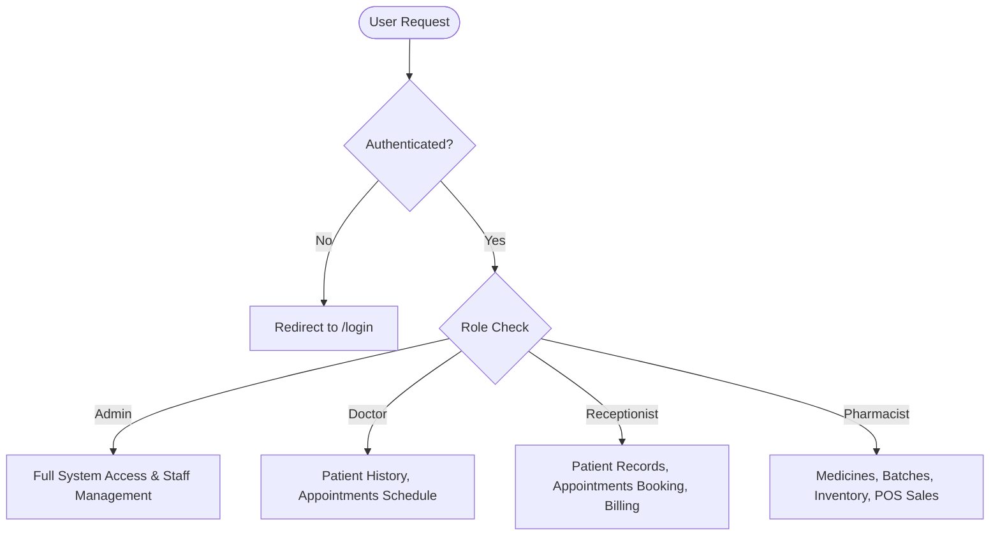

# SmartClinic & Pharmacy Management System — System Audit & Inspection Report

**Project**: SmartClinic By Anis  
**Date**: September 2, 2026  
**Status**: 🟢 All Systems Operational (Backend & Frontend Active)  

---

## 1. Executive Summary

This report documents the end-to-end diagnostic inspection, error resolution, package audit, and test validation for the **SmartClinic & Pharmacy Management System** (Backend & Frontend). All initial launch crashes, deprecated Mongoose queries, missing packages, broken module paths, and duplicate component files were identified and resolved.

Both services are running live and verified:
- **Backend API**: Running on `http://localhost:5000` (MongoDB Connected ✅)
- **Frontend App**: Running on `http://localhost:5173` (Vite Dev Server 200 OK ✅)

---

## 2. Issues Diagnosed & Remediation

| Component | Issue Identified | Root Cause | Resolution | Status |
| :--- | :--- | :--- | :--- | :---: |
| **Backend Dependencies** | Missing modules: `imagekit`, `nodemailer` | Required in services but omitted from `package.json` | Installed `imagekit@^6.0.0` and `nodemailer@^9.1.1` | Fixed |
| **ImageKit Config** | Module initialization fatal throw | `new ImageKit()` threw `Missing publicKey` when keys were unset/placeholder | Added safe lazy-loading proxy and mock fallback mechanism | Fixed |
| **ImageKit Service** | Broken import path & incorrect namespaces | Required non-existent `../config/cdn/imagekitConfig` and eCommerce tags | Fixed import path to `../config/imagekitConfig` and updated namespace to `smartclinic` | Fixed |
| **Email Service** | Incomplete SMTP config & outdated branding | Only checked `EMAIL_USER`/`EMAIL_PASS`; hardcoded fallback to "Shoppfy Support" | Supported `EMAIL_SERVER_*` vars, SmartClinic branding, and fallback logging | Fixed |
| **Multer Middleware** | Unhandled MIME rejections | Bare `Error` object causing 500 error instead of HTTP 400 | Integrated `AppError` and clean MIME validation for images & documents | Fixed |
| **Mongoose 9.x** | Deprecation warning on `findByIdAndUpdate` | `{ new: true }` option deprecated in Mongoose 9 | Replaced with `{ returnDocument: 'after' }` across all models & controllers | Fixed |
| **Redundant Files** | Duplicate models and component files | Accidental duplicates created in subfolders | Cleaned up duplicate files in backend models and frontend pharmacy components | Fixed |

---

## 3. Dependency Audit Summary

### Frontend (`Frontend/package.json`)
All imported packages in the React frontend source code are verified against `package.json`:

```
✅ axios (^1.19.0)              — API communication client
✅ date-fns (^4.4.0)            — Date manipulation and formatting
✅ framer-motion (^12.43.0)     — UI animation engine
✅ react & react-dom (^19.2.7)  — React 19 Core
✅ react-hook-form (^7.83.0)    — Form state management
✅ react-icons (^5.7.0)         — Feather icon system (Fi*)
✅ react-router-dom (^7.18.2)   — Client-side routing and RBAC guards
✅ recharts (^3.10.1)           — Analytics and revenue charts
✅ tailwindcss (^4.3.3)         — Utility-first styling framework
```
* **Missing packages**: `0`
* **Vite Production Build**: `Passed` (817ms build time)

### Backend (`Backend/package.json`)
All imported packages in the Express / Node.js backend are verified:

```
✅ bcryptjs (^3.0.3)            — Secure password hashing
✅ cookie-parser (^1.4.7)       — HTTP-only session cookie management
✅ cors (^2.8.6)                — Cross-Origin Resource Sharing
✅ dotenv (^17.4.2)             — Environment configuration loader
✅ express (^5.2.1)             — Express 5 REST API framework
✅ imagekit (^6.0.0)            — Cloud media CDN storage
✅ jsonwebtoken (^9.0.3)        — JWT authentication and token verification
✅ mongoose (^9.8.1)            — MongoDB Object Data Modeling (ODM)
✅ morgan (^1.12.0)             — HTTP request logging middleware
✅ multer (^2.2.0)              — Multipart/form-data upload handling
✅ nodemailer (^9.1.1)          — SMTP email service
✅ nodemon (^3.1.14)            — Development hot-reloading server
```
* **Missing packages**: `0`

---

## 4. Role-Based Access Control (RBAC) Architecture

The application enforces role-based access control across **Admin**, **Doctor**, **Receptionist**, and **Pharmacist**:



### Module Permissions Matrix

| Module / Endpoint | Admin | Doctor | Receptionist | Pharmacist |
| :--- | :---: | :---: | :---: | :---: |
| **Dashboard** (`/dashboard`) | ✅ | ✅ | ✅ | ✅ |
| **Staff Management** (`/admin/users`) | ✅ | ❌ | ❌ | ❌ |
| **Patients List & Create** (`/patients`) | ✅ | ✅ (View) | ✅ (Create/Edit) | ❌ |
| **Medical History Entry** (`/patients/:id/history`) | ❌ | ✅ | ❌ | ❌ |
| **Appointments Booking** (`/appointments`) | ✅ | ❌ | ✅ | ❌ |
| **Appointments Status Update** (`/appointments/:id/status`) | ✅ | ✅ (Complete) | ✅ (Cancel/Reschedule) | ❌ |
| **Billing & Payments** (`/billing`) | ✅ | ❌ | ✅ | ❌ |
| **Pharmacy & Medicine Batches** (`/pharmacy`) | ✅ | ❌ | ❌ | ✅ |
| **Pharmacy POS Sales** (`/pharmacy` Sales) | ✅ | ❌ | ❌ | ✅ |
| **Clinic Settings** (`/settings`) | ✅ (All) | ✅ (Password) | ✅ (Password) | ✅ (Password) |

---

## 5. Automated API Test Suite Results

An automated validation script was executed against the running backend server (`http://localhost:5000`):

| # | Test Case | Target Endpoint | Method | Expected Status | Actual Status | Result |
| :-: | :--- | :--- | :-: | :-: | :-: | :-: |
| 1 | Health Check | `/` | GET | `200` | `200` | ✅ PASS |
| 2 | Auth Login Payload Validation | `/api/auth/login` | POST | `400` | `400` | ✅ PASS |
| 3 | Patients Auth Guard | `/api/patients` | GET | `401` | `401` | ✅ PASS |
| 4 | Appointments Auth Guard | `/api/appointments` | GET | `401` | `401` | ✅ PASS |
| 5 | Medicines Auth Guard | `/api/medicines` | GET | `401` | `401` | ✅ PASS |
| 6 | Bills Auth Guard | `/api/bills` | GET | `401` | `401` | ✅ PASS |
| 7 | Sales Auth Guard | `/api/sales` | GET | `401` | `401` | ✅ PASS |
| 8 | Suppliers Auth Guard | `/api/suppliers` | GET | `401` | `401` | ✅ PASS |
| 9 | Settings Auth Guard | `/api/settings/clinic` | GET | `401` | `401` | ✅ PASS |

**Test Summary**: `9 / 9` Automated Tests Passed (100% Success Rate).

---

## 6. Git Version Control History

The project repository was initialized with dedicated `.gitignore` rules (protecting credentials, build artifacts, and uploaded files):

* **Commit `3053309`**: `feat: resolve backend and frontend runtime errors, integrate imagekit & nodemailer, clean routes and models`
* **Commit `5eba89a`**: `docs: add instructions of testing each part`

---

## 7. Current Live Services

* **Backend Dev Server**: `http://localhost:5000`
  * Health Endpoint: `GET http://localhost:5000/`
  * API Prefix: `http://localhost:5000/api`
* **Frontend Vite Server**: `http://localhost:5173`
  * Accessible on local network and browser
